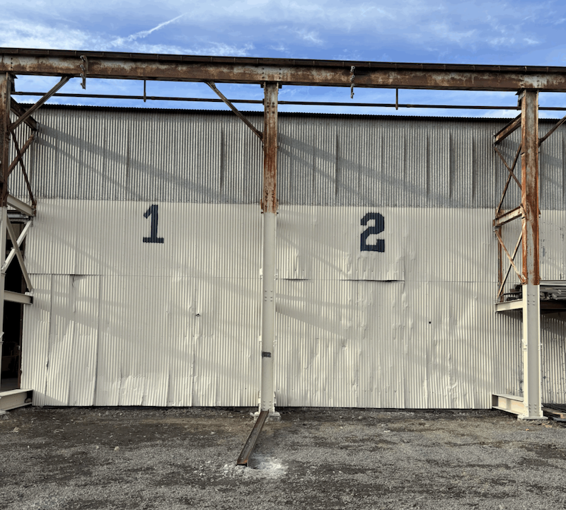

```text
________             _____________     __________                    ______  _______
___  __ \______________  /___  __/________  /__(_)_____       ___   ___|__ \ __  __ \
__  /_/ /  __ \_  ___/  __/_  /_ _  __ \_  /__  /_  __ \________ | / /___/ / _  / / /
_  ____// /_/ /  /   / /_ _  __/ / /_/ /  / _  / / /_/ //_____/_ |/ /_  __/__/ /_/ /
/_/     \____//_/    \__/ /_/    \____//_/  /_/  \____/       _____/ /____/(_)____/
```

# Portfolio Website Development Process

## Project Structure

```text
Portfolio 2.0
├── index.html
│   ├── <head>
│   │   ├── Metadata and title
│   │   ├── styles.css
│   │   └── script.js
│   └── <body>
│       ├── <header>
│       │   ├── Profile image
│       │   ├── Name and summary
│       │   └── Navigation
│       └── <main>
│           ├── About
│           ├── Education
│           ├── Certifications
│           ├── Skills
│           ├── Résumé
│           │   └── Employers
│           │       └── Positions and responsibilities
│           ├── Projects
│           │   ├── Portfolio websites
│           │   └── Operational projects
│           │       ├── Image galleries
│           │       └── Descriptions
│           └── Contact
│               ├── Email
│               ├── GitHub
│               └── LinkedIn
├── styles.css
│   ├── Global and image styles
│   ├── Header and navigation
│   ├── Main section cards
│   ├── Skill and certification styles
│   ├── Résumé and project cards
│   ├── Image galleries
│   └── Link and contact styles
├── script.js
└── images
    ├── Profile image
    ├── Certification images
    └── Project images
```

## Project Overview

I created this portfolio as a single-page website that presents my professional background, technical skills, certifications, résumé, and projects in one organized interface. Instead of separating the content across multiple pages, I divided it into sections that visitors can reach by scrolling or by using the navigation menu.

I separated the project into three main files:

- `index.html` defines the content and semantic structure.
- `styles.css` controls the layout and visual presentation.
- `script.js` provides a place for interactive functionality.

Separating structure, presentation, and behavior makes the project easier to understand and maintain as it grows.

## HTML Document Setup

I began with the standard HTML5 document structure:

```html
<!doctype html>
<html lang="en">
<head>
    <meta charset="UTF-8">
    <meta name="viewport" content="width=device-width, initial-scale=1.0">
    <title>Erich O'Donnell | Portfolio</title>
    <link rel="stylesheet" href="styles.css">
    <script src="script.js" defer></script>
</head>
```

The doctype tells the browser to use modern HTML standards, while `lang="en"` identifies the language for browsers, search engines, and screen readers.

The UTF-8 character encoding allows text and special characters to display correctly. The viewport setting helps the layout adapt to mobile screen sizes.

I linked the CSS as an external stylesheet to keep the presentation separate from the HTML. I also added the `defer` attribute to the JavaScript file so the script does not block the browser while the HTML is being parsed.

## Semantic Page Structure

I used semantic HTML elements such as `<header>`, `<nav>`, `<main>`, `<section>`, `<article>`, and `<address>` to describe the purpose of the content.

The page is divided into two primary regions:

```html
<header>
    <!-- Introductory content and navigation -->
</header>

<main>
    <!-- Portfolio content -->
</main>
```

The `<header>` introduces me and contains the primary navigation. The `<main>` element contains the unique portfolio content.

Using semantic elements makes the document easier for browsers, search engines, screen readers, and developers to understand. The content also remains logically organized if the CSS does not load.

## Header

The header contains my profile photograph, name, professional interests, and primary navigation.

```html
<header>
    
    <h1>Erich O'Donnell</h1>
    <p>
        Programming Enthusiast | IoT | Web Development |
        HTML | CSS | JavaScript | Economics
    </p>
</header>
```

I used my name as the only `<h1>` because I am the main subject of the page. The paragraph below my name gives visitors a quick summary of my professional and technical interests.

The profile image includes alternative text so it can still be understood by screen-reader users or when the image cannot load.

## Navigation

I created the navigation using an unordered list inside a semantic `<nav>` element:

```html
<nav aria-label="Main Navigation">
    <ul>
        <li><a href="#about">About</a></li>
        <li><a href="#education">Education</a></li>
        <li><a href="#certifications">Certifications</a></li>
        <li><a href="#skills">Skills</a></li>
        <li><a href="#resume">Resume</a></li>
        <li><a href="#projects">Projects</a></li>
        <li><a href="#contact">Contact</a></li>
    </ul>
</nav>
```

Each link uses a fragment identifier that matches the ID of a section on the page. For example:

```html
<a href="#projects">Projects</a>
```

points to:

```html
<section id="projects">
    <h2>Projects</h2>
</section>
```

This creates functional in-page navigation without requiring JavaScript. The `aria-label` also gives the navigation landmark an accessible name.

## Main Content

Inside the `<main>` element, I divided the portfolio into the following sections:

- About
- Education
- Certifications
- Skills
- Résumé
- Projects
- Contact

Each section has a unique ID and an `<h2>` heading:

```html
<section id="skills">
    <h2>Skills</h2>
</section>
```

The IDs provide navigation targets, while the headings establish a logical document hierarchy.

I used the following heading structure:

- `<h1>` for my name and the page identity
- `<h2>` for the primary portfolio sections
- `<h3>` for project titles and résumé categories
- `<h4>` for employer names
- `<h5>` for individual positions

I selected heading levels based on how the content relates rather than using headings only to control text size.

## About and Education

The About section connects my economics education and professional experience with my interest in programming and technology. My background includes finance, retail, manufacturing, operations, and process improvement.

I divided the introduction into multiple paragraphs so each idea has its own focus and the content is easier to read.

The Education section presents the institutions I attended and my degrees. The information could later be expanded to include fields of study, graduation years, and additional details.

## Certifications and Skills

I used unordered lists for the Certifications and Skills sections because they contain related items without a required sequence.

```html
<ul>
    <li>Operations Management</li>
    <li>Production Coordination</li>
    <li>Process Improvement</li>
    <li>HTML</li>
    <li>CSS</li>
    <li>Raspberry Pi</li>
</ul>
```

The HTML remains a semantic list even though the CSS changes its visual presentation.

The skills represent several areas of my experience, including management, manufacturing, communication, business software, web development, and IoT.

The Certifications section also uses a list, with each entry containing a badge or certificate image and its written name.

## Résumé Structure

I represented each employer as an `<article>` because every employment entry is a self-contained part of my professional history.

```html
<article class="job">
    <h4>Northeast Fence &amp; Iron Works, Inc.</h4>

    <section class="position">
        <h5>Production Manager</h5>
        <ul>
            <li>Directed daily operations for the Westmoreland Department.</li>
            <li>Managed production schedules and workflow efficiency.</li>
        </ul>
    </section>
</article>
```

When I held multiple positions with the same employer, I organized those positions as nested sections. This creates a clear relationship between the employer and the individual roles.

I used bullet points for job responsibilities because résumé information is easier to scan when it is presented as focused, action-oriented statements.

## Projects

I used an `<article>` for each project because every project has its own title, description, images, and optional repository link.

```html
<article class="project">
    <h3>Portfolio Website v2.0</h3>
    <p>An updated version of my website built with HTML and CSS.</p>
    <p>
        <a href="https://github.com/...">
            View project on GitHub
        </a>
    </p>
</article>
```

I included programming projects to demonstrate my progress with HTML and CSS. I also included operational improvement projects to demonstrate leadership, organization, equipment operation, and process improvement.

I grouped related project images inside a dedicated container:

```html
<div class="project-images">
    
</div>
```

The container gives the images a shared CSS layout target, while the alternative text explains the purpose of the image.

## Contact Information

I placed my email, GitHub profile, and LinkedIn profile inside an `<address>` element:

```html
<address>
    <p>
        Email:
        <a href="mailto:erich_o@icloud.com">
            erich_o@icloud.com
        </a>
    </p>
</address>
```

The `<address>` element is appropriate because the content provides ways to contact the author of the page.

## Base CSS

After establishing the HTML structure, I created the global page styles:

```css
body {
    margin: 0;
    font-family: Arial, sans-serif;
    line-height: 1.6;
    background-color: #1f2937;
    color: #222;
}

img {
    max-width: 100%;
    height: auto;
}
```

Removing the default body margin allows the header to extend across the full viewport. The line height gives paragraphs and list items comfortable vertical spacing.

The global image rule allows images to shrink with their containers while preserving their aspect ratios.

## Color Palette

I designed the website around a dark-gray and blue color palette. The dark header creates a strong introduction, while blue is used as the main accent color throughout the navigation, links, headings, résumé cards, skill badges, and profile-image border.

The main colors include:

- `#1f2937` for dark backgrounds
- `#374151` for navigation links
- `#3b82f6` and `#2563eb` for accents
- `#ffffff` for primary cards
- `#f8fafc` for nested content
- `#dbeafe` and `#1e3a8a` for skill badges

## Profile Image

I styled the profile image as a circle:

```css
header img {
    width: 150px;
    height: 150px;
    border-radius: 50%;
    object-fit: cover;
    border: 4px solid #3b82f6;
}
```

The equal width and height create a square image box. The `50%` border radius changes the square into a circle, while `object-fit: cover` fills the area without stretching the photograph.

## Navigation Styling

I displayed the navigation list items as inline blocks and styled the anchors as buttons:

```css
nav li {
    display: inline-block;
    margin: 5px;
}

nav a {
    color: white;
    text-decoration: none;
    background-color: #374151;
    padding: 10px 15px;
    border-radius: 6px;
}
```

This creates a horizontal navigation menu while allowing the links to wrap when the screen becomes narrower. The padding increases the clickable area, and the rounded background visually separates each link.

## Main Layout

I limited and centered the main content area:

```css
main {
    max-width: 1000px;
    margin: auto;
    padding: 30px 20px;
}
```

The maximum width prevents the layout from stretching across an entire large display. Automatic margins center the content, while the padding creates space between the content and the viewport edges.

## Section Cards

I styled the main sections as white cards:

```css
section {
    background-color: white;
    margin-bottom: 25px;
    padding: 25px;
    border-radius: 10px;
    box-shadow: 0 3px 10px lightgray;
}
```

The white backgrounds improve readability, while the padding, rounded corners, and shadows separate the content from the darker page background.

Job and project entries use lighter backgrounds to create another level of visual hierarchy inside the main cards.

## Skill Badges

I styled the skill list items as rounded badges:

```css
#skills li {
    display: inline-block;
    background-color: #dbeafe;
    color: #1e3a8a;
    padding: 8px 12px;
    margin: 5px;
    border-radius: 15px;
}
```

The HTML remains an unordered list, but the CSS gives the skills a more visual and scannable appearance.

## Project Images

I centered the project images and gave them a consistent display size:

```css
.project-images {
    text-align: center;
}

.project-images img {
    width: 250px;
    margin: 5px;
    border-radius: 8px;
}
```

The global image rule allows the images to shrink on smaller screens, while the target width creates a more uniform gallery on larger screens.
